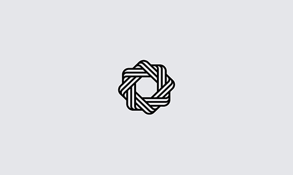

    

    	
    

    <h4>vr试验管理平台项目</h4>
    <h4>VR test management platform project</h4>
    
Isn't adding one more sentence of English to make you look bigger

    

		
        
        
    

    

    	
    

​      

## 项目描述

​	项目为pc端学生实验管理平台，按使用人员划分三个模块，学生端，教师端，公共端。按照功能分为实验展示模块，实验创建模块，在线测试模块，试验评分模块，学生成绩管理模块。

## 项目开发文档

## 工作记录

### cotton:

- 2021/1/27
  - 修改了更改密码和修改手机号时的验证bug，修改了头像显示问题。
  - 完成实验小组列表，发布，删除，撤回接口对接，小组成员列表，删除，批改，接口对接，实验查询列表接口对接。
  - 补充题库预览界面和小组成员列表。
  - 完善了教师中心我的实验tab面板内部几个界面的切换逻辑。

### cc:

